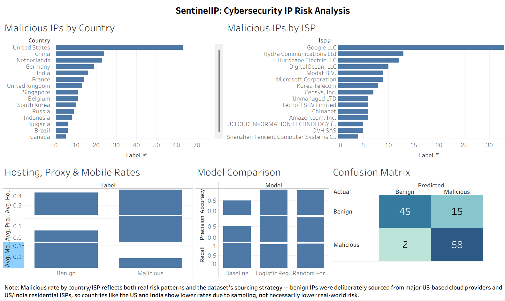
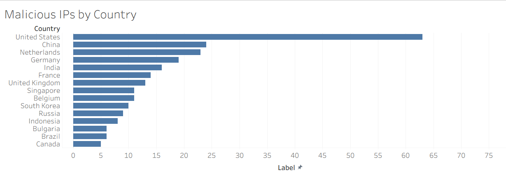
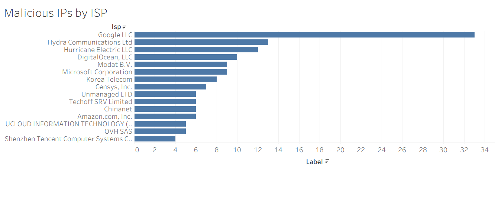
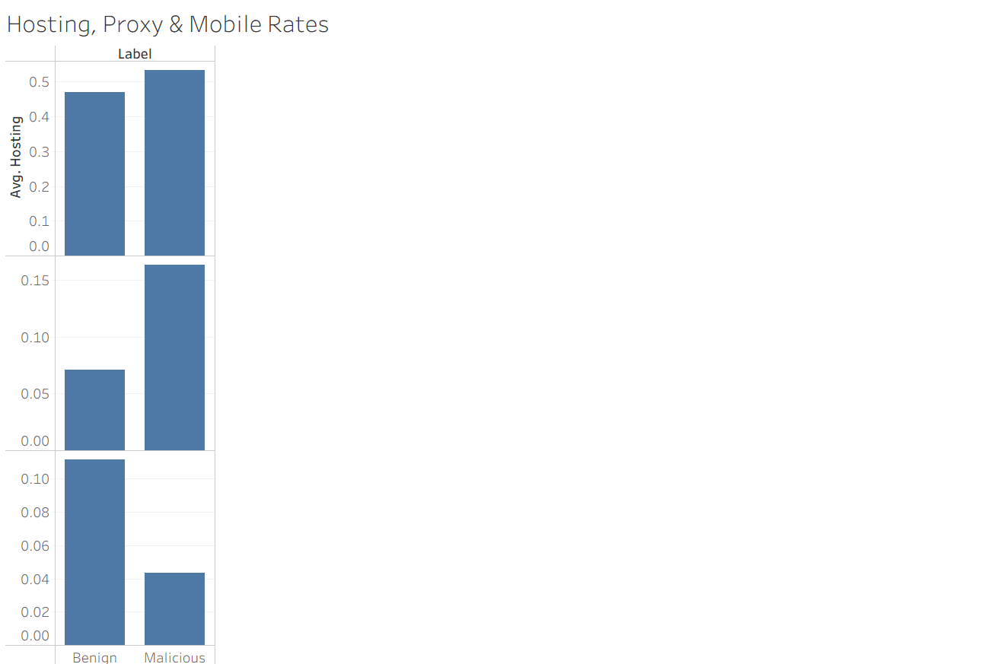
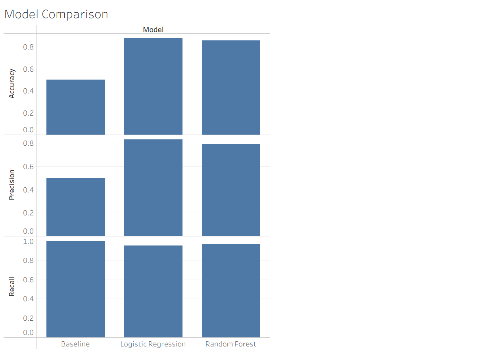
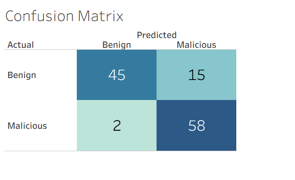

# SentinelIP

Classifying malicious IP addresses using network metadata alone, without ever exposing the model to an existing risk score.

## The question

Can you tell whether an IP address is malicious using only things like country, ISP, and whether it's a hosting server, a known proxy, or on a mobile connection — without ever letting the model see a pre-existing risk score?

To keep that honest, the project uses two independent data sources: one gives the label, the other gives the features, and they never overlap.

- **AbuseIPDB** provides the label. An IP counts as malicious if it has an abuse confidence score of 75 or higher, reported within the last 90 days.
- **ip-api.com** provides the features: country, ISP, network organization, and whether the IP is flagged as hosting, proxy, or mobile.

AbuseIPDB's own confidence score is never used as a model input, only as the answer key. The goal was to see whether a model could learn the actual pattern of what malicious infrastructure looks like, rather than just reproducing a number it was handed.

## Dataset

Around 600 IPs, split roughly evenly between malicious and benign.

The malicious set (300 IPs) came from AbuseIPDB's blacklist endpoint. For the benign set, a quick diagnostic on the malicious sample showed that only about 56 percent of malicious IPs were hosting-provider infrastructure — the rest looked residential, likely compromised home devices. So the benign set was built to reflect that same mix rather than skew entirely toward data centers:

- roughly 168 IPs from AWS, Google Cloud, and Cloudflare's published IP ranges
- roughly 128 IPs from real residential ISP ranges (Comcast, AT&T, Airtel, Reliance Jio), pulled via RIPE's public ASN lookup service

Both sources were verified for zero overlap and zero duplicate IPs before anything went further.

## Pipeline

```
AbuseIPDB + ip-api.com  →  Python collection scripts  →  PostgreSQL  →  SQL analysis  →  feature engineering  →  Logistic Regression + Random Forest  →  Tableau dashboard
```

Data collection ran into real API rate limiting partway through (ip-api.com's free tier caps at 45 requests/minute, and the collection script's first pass hit that wall hard). The fix was retry logic with exponential backoff plus a deduplication step that keeps the successful result for any IP that had to be retried, rather than restarting from scratch each time.

## SQL findings

A few things worth calling out from the SQL analysis:

**Hosting status alone is a weak signal.** 53 percent of malicious IPs were hosting infrastructure versus 47 percent of benign ones — a small gap, expected given the benign set intentionally includes real cloud servers too.

**Proxy and mobile pull in opposite directions.** Malicious IPs were more than twice as likely to be flagged as a known proxy (16 percent versus 7 percent). Mobile went the other way: 4 percent of malicious IPs were mobile against 11 percent of benign ones. Mobile connections are unreliable and easy to trace back to a real SIM, which makes them poor infrastructure for running anything sustained.

**Hosting and proxy together is the strongest signal in the dataset.** Individually, each is only a moderate indicator. IPs that were both hosting and proxy showed a 97 percent malicious rate, far beyond what either flag suggested alone. This became the basis for an engineered `hosting_and_proxy` interaction feature used in modeling.

**Country and ISP rankings need a sample-size filter to be trustworthy.** Early results showed Russia and Bulgaria at a 100 percent malicious rate, but both had fewer than 10 total IPs in the dataset, all sourced through the malicious channel. Once filtered to countries with at least 15 total IPs, a more reliable picture emerged: China, Germany, France, and the Netherlands all showed consistently high malicious rates (75 to 96 percent), while the US and India sat much lower — largely because that is where the benign sourcing was concentrated, not because those countries are inherently safer.

## Modeling

Two models were trained and compared rather than picking one and discarding the other: Logistic Regression as a baseline, and Random Forest to test whether it could pick up on the hosting-and-proxy interaction on its own.

Both were evaluated at a decision threshold of 0.3, not the default 0.5. That decision took some second-guessing. At 0.5, Logistic Regression had better accuracy (92 percent) and precision (92 percent) than at 0.3 (88 percent and 83 percent respectively). On paper, 0.5 looks like the better setting. But accuracy treats every error the same way, and in this context the two error types are not equally costly: missing an actual malicious IP is a meaningfully worse outcome than a false alarm that costs someone a few minutes of review. Moving to 0.3 caught 3 additional real threats out of 60, at the cost of 7 more false alarms — a tradeoff worth making given what the model is for.

| Model | Recall | Precision | Accuracy |
|---|---|---|---|
| Baseline (always predicts malicious) | 1.00 | 0.50 | 0.50 |
| Logistic Regression (threshold 0.3) | 0.95 | 0.83 | 0.88 |
| Random Forest (threshold 0.3) | 0.97 | 0.79 | 0.86 |

Random Forest edges out Logistic Regression on recall, and its feature importances independently confirmed the SQL findings — hosting and the engineered hosting-and-proxy feature both ranked near the top, without being told to look for that combination directly.

Five-fold cross-validation told a more complicated story, though. Random Forest's recall ranged from 70 percent to 97 percent depending on the fold, while Logistic Regression stayed consistently in the mid-80s across every fold. With around 600 rows total, that swing is a real stability concern, not noise. Random Forest wins on the headline number; Logistic Regression is the more predictable model. Both are reported here rather than picking a single winner and hiding the tradeoff.

## Dashboard

Built in Tableau, connected via CSV export rather than a live database connection (Tableau's PostgreSQL driver wasn't available in this setup, and a CSV-based workflow made more sense for a fixed, completed dataset anyway).



Malicious IP concentration by country and by ISP:





Hosting, proxy, and mobile rates split by class:



Model comparison across accuracy, precision, and recall:



The confusion matrix is interactive in the actual workbook — a dropdown switches between all three models. Shown here for Random Forest:



## What I'd change with more data or time

The country and ISP risk rankings are limited by where the benign IPs were sourced from. A future version should pull benign traffic from a wider spread of countries so those comparisons aren't skewed by sourcing decisions.

The Random Forest feature importance also flagged something unexpected: the "everything outside the top 10 ISPs" bucket was the single strongest predictor in the model, ahead of any individually named ISP. That suggests there's real signal buried in the long tail of small, obscure hosting providers that a top-N grouping approach doesn't fully capture, and it would be worth investigating with a larger dataset.

Random Forest's instability across cross-validation folds is likely a small-sample problem. It would be worth revisiting once the dataset grows past a few thousand rows to see whether that gap with Logistic Regression closes.

## Project structure

```
sentinelip/
├── README.md
├── requirements.txt
├── .env.example
├── .gitignore
│
├── data/
│   ├── raw/                 malicious_ips_raw.json, residential_benign_ips.json, hosting_benign_ips.json
│   └── processed/           final_dataset.jsonl, ip_data_export.csv, model_results.csv, confusion_matrix_long.csv
│
├── scripts/
│   ├── collection/          fetch_malicious_ips.py, fetch_residential_ips.py, fetch_hosting_ips.py, enrich_and_combine.py
│   ├── database/            load_to_postgres.py, test_postgres_connection.py
│   ├── analysis/            check_malicious_profile.py, verify_dataset.py
│   ├── modeling/            feature_engineering.py, train_model.py, train_random_forest.py, model_comparison.py
│   └── export/              export_for_tableau.py
│
├── dashboard/
│   ├── sentinelip.twbx
│   └── screenshots/
│
└── docs/
    └── case_study.md
```

## Tools

Python (requests, pandas, scikit-learn, psycopg2, SQLAlchemy), PostgreSQL, SQL, Tableau, Logistic Regression, Random Forest, AbuseIPDB API, ip-api.com, RIPEstat.
